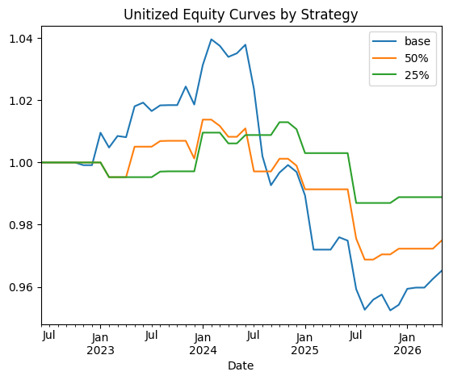

A  backtest of three different sp500 trading strategies based on 200d MA and intraday price ranges at month end dates. 

Leverages data from WSJ.

Summary Stats by Strategy - the 25% strategy wins, it not only produces the smaller loss over the 4y period, but its return profile is less volatile as well.

Trades	Total return	Max drawdown	Sharpe (ann.)
base	38.0	-0.034915	-0.083881	-0.374902
50%	18.0	-0.025178	-0.044405	-0.411824
25%	11.0	-0.011158	-0.025651	-0.233786

Potential Refinements:
1. Cash drag - currently strategies earn 0% when not invested, 1m bills is better
2. Capital gains only - dividends should be included in total return

